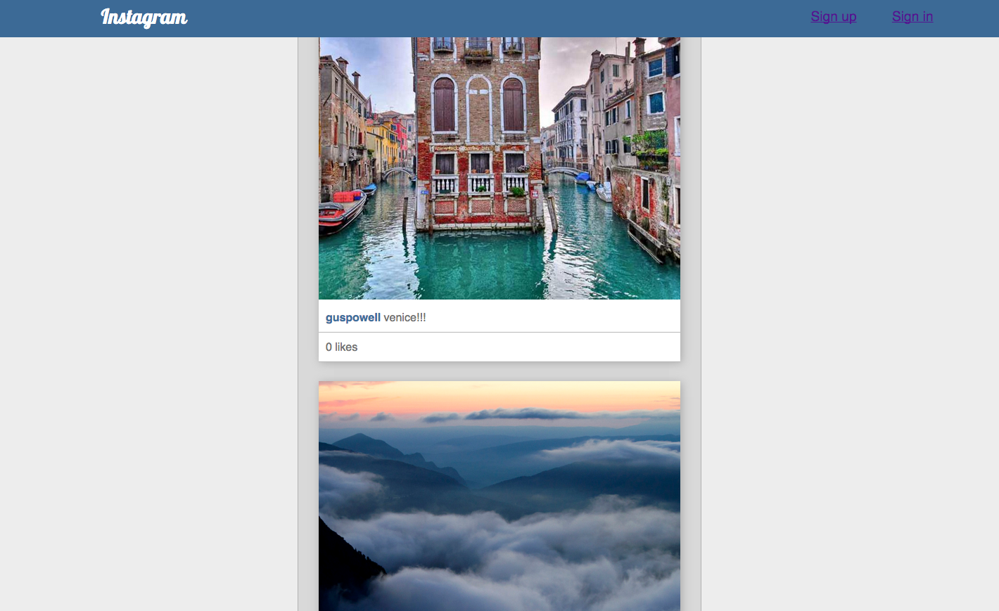

Instagram in Rails
=======================

Introduction
--------------------

After four days of learning Rails, the weekend challenge was to replicate Instagram using everything we had learnt that week.

Screenshot
---------------




Languages - Frameworks - Tools
--------------------------------

- Ruby on Rails
- Paperclip
- RSpec
- Devise


Instructions
------------------
Clone the repository:
```
$ git clone git@github.com:bebbs/instagram-challenge.git
```
Change into the repository:
```
$ cd instagram-challenge
```
Install all the dependencies:
```
$ bundle install
```
Create the database:
```
$ psql
=# CREATE DATABASE instagram_challenge_test;
=# CREATE DATABASE instagram_challenge_development;
=# \q
```
Run the tests:
```
$ rspec
```
To view the app, start the rails server:
```
$ rails server
```
Visit http://localhost:3000/

To Do
------------------
- Add relationships between users, comments and likes.
- Style the sign in and sign up links.
- Make the page responsive.
- Make it so you can only see posts when you are logged in
